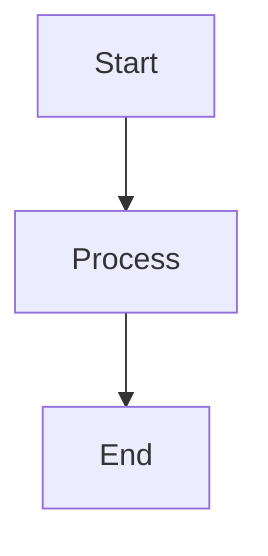

# CLAUDE.md

This file provides guidance to Claude Code (claude.ai/code) when working with code in this repository.

## Project Overview

Project tzf is a documentation site built with Hugo and the Thulite/Doks theme framework. It serves as the central hub for documenting the tzf ecosystem - a collection of libraries that convert GPS coordinates to timezones across multiple programming languages (Go, Rust, Python, Swift, Ruby, JavaScript/WASM, etc.).

## Development Commands

### Core Hugo Commands
- **Development server**: `bun run dev` - Starts Hugo server with draft content, no caching, and live reload
- **Production build**: `bun run build` - Builds optimized site with minification and garbage collection
- **Create new content**: `bun run create <path>` - Creates new content files using Hugo archetypes
- **Code formatting**: `bun run format` - Formats all files using Prettier
- **Preview production build**: `bun run preview` - Preview the built site using Vite

### Environment Requirements
- Node.js >= 20.11.0
- Hugo 0.125.1 (specified in netlify.toml)
- npm 10.2.4 (specified in netlify.toml)

## Architecture

### Hugo Site Structure
- **Config**: Multi-environment Hugo configuration in `config/_default/` with separate files for different concerns
- **Content**: Markdown content organized in `content/` with docs, blog, and main sections
- **Layouts**: Custom Hugo templates in `layouts/` extending the Doks theme
- **Assets**: Static assets in `assets/` including SCSS, JavaScript, and images
- **Theme**: Built on Thulite Doks core (`@thulite/doks-core`) with additional Thulite modules

### Key Configuration Files
- `hugo.toml`: Main Hugo configuration with multilingual support, taxonomies, and output formats
- `params.toml`: Doks theme configuration including search, navigation, and UI settings
- `menus/menus.en.toml`: Navigation menu structure
- `netlify.toml`: Deployment configuration with build commands and security headers

### Content Organization
- **Docs section**: Technical documentation with guides and reference materials
- **Blog section**: Project updates and articles
- **Multilingual**: Configured for English as default with Dutch and German disabled

### Dependencies
- **Core theme**: @thulite/doks-core for documentation site functionality
- **Image processing**: @thulite/images for responsive image handling
- **Icons**: @tabler/icons for UI icons
- **SVG**: @thulite/inline-svg for inline SVG support
- **SEO**: @thulite/seo for search engine optimization

## Development Workflow

### Content Creation
Use `bun run create` to generate new content files with proper front matter. Content is organized by type (docs, blog) and uses Hugo's content management features.

### Mermaid Diagrams
Mermaid diagram support is enabled through Hugo's code block render hooks. To add diagrams:
1. Use fenced code blocks with `mermaid` language identifier
2. Mermaid script loads automatically only on pages containing diagrams
3. Supports all Mermaid diagram types (flowcharts, sequence diagrams, etc.)

Example:
````markdown

````

### Styling
Custom SCSS in `assets/scss/common/` extends the Doks theme. Variables can be customized in `_variables-custom.scss`.

### Build Process
The site builds to `public/` directory and includes:
- Asset optimization and minification
- Search index generation
- Sitemap creation
- Multi-format output (HTML, RSS, JSON search index)

### Deployment
Configured for Netlify deployment with:
- Automatic builds on push
- Security headers including CSP, HSTS, and frame protection
- Hugo version pinning for consistent builds