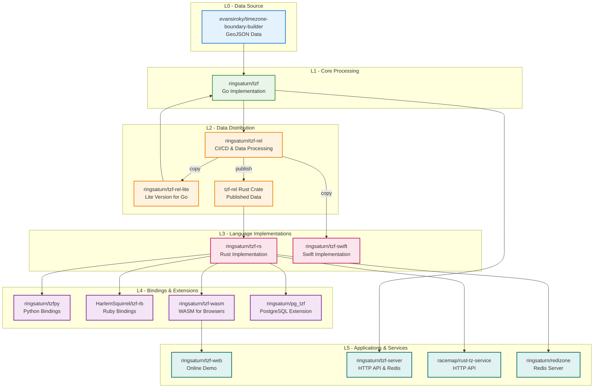

- **L0 - Data Source**: Raw geographic timezone boundary data from upstream providers
  - [evansiroky/timezone-boundary-builder](https://github.com/evansiroky/timezone-boundary-builder)
- **L1 - Core Processing**: Primary data processing and CI/CD infrastructure for the ecosystem
  - [ringsaturn/tzf](https://github.com/ringsaturn/tzf)
- **L2 - Data Distribution**: Processed and packaged data ready for consumption by different language ecosystems
  - [ringsaturn/tzf-rel](https://github.com/ringsaturn/tzf-rel)
  - [ringsaturn/tzf-rel-lite](https://github.com/ringsaturn/tzf-rel-lite)
  - [tzf-rel Rust Crate](https://crates.io/crates/tzf-rel)
- **L3 - Language Implementations**: Core timezone lookup implementations in different programming languages
  - [ringsaturn/tzf-rs](https://github.com/ringsaturn/tzf-rs)
  - [ringsaturn/tzf-swift](https://github.com/ringsaturn/tzf-swift)
- **L4 - Language Bindings & Extensions**: Wrapper libraries and database extensions built on top of core implementations
  - [ringsaturn/tzfpy](https://github.com/ringsaturn/tzfpy)
  - [HarlemSquirrel/tzf-rb](https://github.com/HarlemSquirrel/tzf-rb)
  - [ringsaturn/tzf-wasm](https://github.com/ringsaturn/tzf-wasm)
  - [ringsaturn/pg_tzf](https://github.com/ringsaturn/pg_tzf)
- **L5 - Applications & Services**: End-user applications, web services, and API servers
  - [ringsaturn/tzf-web](https://github.com/ringsaturn/tzf-web)
  - [ringsaturn/tzf-server](https://github.com/ringsaturn/tzf-server)
  - [racemap/rust-tz-service](https://github.com/racemap/rust-tz-service)
  - [ringsaturn/redizone](https://github.com/ringsaturn/redizone)
