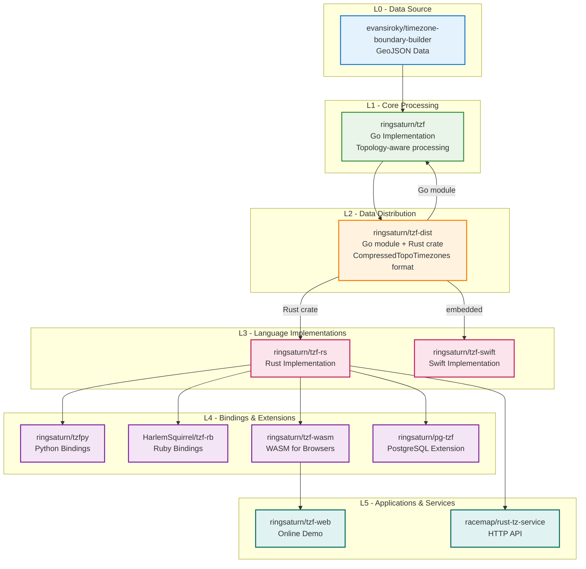

- **L0 - Data Source**: Raw geographic timezone boundary data from upstream providers
  - [evansiroky/timezone-boundary-builder](https://github.com/evansiroky/timezone-boundary-builder)
- **L1 - Core Processing**: Primary data processing — topology-aware polygon simplification,
  shared-edge deduplication, Polyline encoding, and tile pre-index generation
  - [ringsaturn/tzf](https://github.com/ringsaturn/tzf)
- **L2 - Data Distribution**: Processed binary data in `CompressedTopoTimezones` format,
  distributed as a Go module and Rust crate
  - [ringsaturn/tzf-dist](https://github.com/ringsaturn/tzf-dist)
  - Files: `combined-with-oceans.compress.topo.bin` (~17 MB, full precision),
    `combined-with-oceans.topology.compress.topo.bin` (~5.4 MB, lite),
    `combined-with-oceans.topology.preindex.bin` (~2 MB, tile preindex)
- **L3 - Language Implementations**: Core timezone lookup implementations consuming tzf-dist data
  - [ringsaturn/tzf-rs](https://github.com/ringsaturn/tzf-rs)
  - [ringsaturn/tzf-swift](https://github.com/ringsaturn/tzf-swift)
- **L4 - Language Bindings & Extensions**: Wrapper libraries and database extensions built on top of core implementations
  - [ringsaturn/tzfpy](https://github.com/ringsaturn/tzfpy)
  - [HarlemSquirrel/tzf-rb](https://github.com/HarlemSquirrel/tzf-rb)
  - [ringsaturn/tzf-wasm](https://github.com/ringsaturn/tzf-wasm)
  - [ringsaturn/pg-tzf](https://github.com/ringsaturn/pg-tzf)
- **L5 - Applications & Services**: End-user applications, web services, and API servers
  - [ringsaturn/tzf-web](https://github.com/ringsaturn/tzf-web)
  - [racemap/rust-tz-service](https://github.com/racemap/rust-tz-service)
