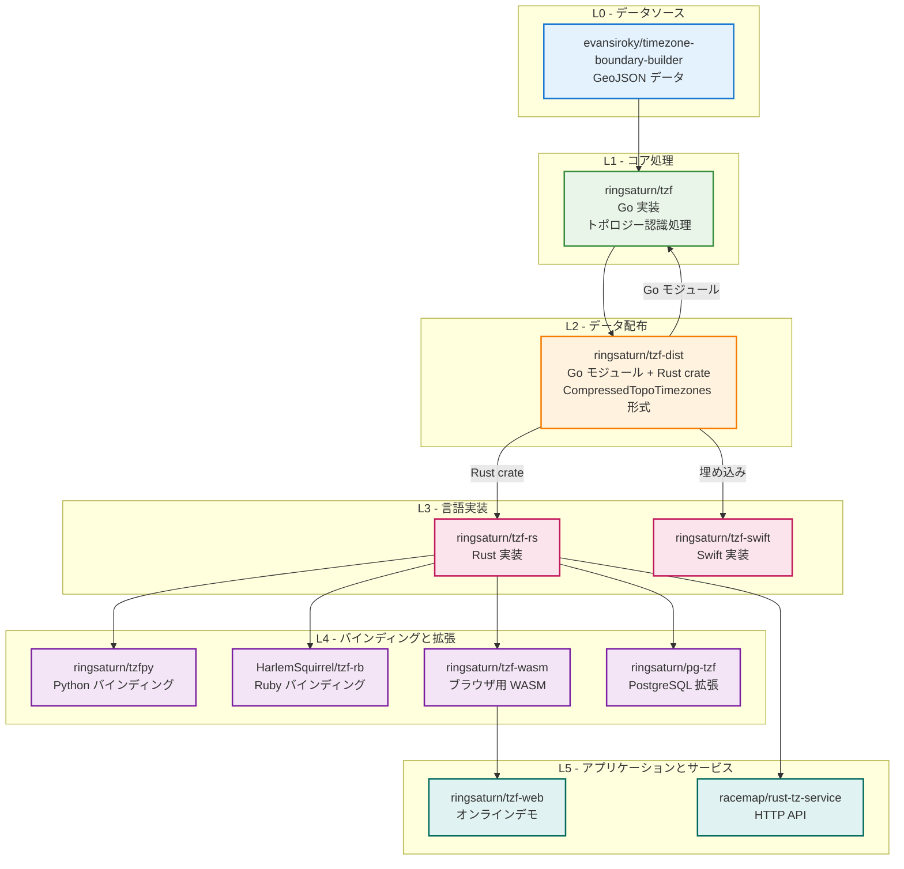

- **L0 - データソース**：上流プロバイダからの生の地理的タイムゾーン境界データ
  - [evansiroky/timezone-boundary-builder](https://github.com/evansiroky/timezone-boundary-builder)
- **L1 - コア処理**：主要データ処理として、トポロジー認識ポリゴン簡略化、
  共有エッジ重複排除、Polyline エンコーディング、タイルプレインデックス生成
  - [ringsaturn/tzf](https://github.com/ringsaturn/tzf)
- **L2 - データ配布**：処理済みバイナリデータを `CompressedTopoTimezones` 形式で
  Go モジュールおよび Rust crate として配布
  - [ringsaturn/tzf-dist](https://github.com/ringsaturn/tzf-dist)
  - ファイル：`combined-with-oceans.compress.topo.bin`（約 17 MB、完全精度）、
    `combined-with-oceans.topology.compress.topo.bin`（約 5.4 MB、ライト版）、
    `combined-with-oceans.topology.preindex.bin`（約 2 MB、タイルプレインデックス）
- **L3 - 言語実装**：tzf-dist データを消費するコアタイムゾーン検索実装
  - [ringsaturn/tzf-rs](https://github.com/ringsaturn/tzf-rs)
  - [ringsaturn/tzf-swift](https://github.com/ringsaturn/tzf-swift)
- **L4 - 言語バインディングと拡張**：コア実装上に構築されたラッパーライブラリとデータベース拡張
  - [ringsaturn/tzfpy](https://github.com/ringsaturn/tzfpy)
  - [HarlemSquirrel/tzf-rb](https://github.com/HarlemSquirrel/tzf-rb)
  - [ringsaturn/tzf-wasm](https://github.com/ringsaturn/tzf-wasm)
  - [ringsaturn/pg-tzf](https://github.com/ringsaturn/pg-tzf)
- **L5 - アプリケーションとサービス**：エンドユーザーアプリケーション、Web サービス、API サーバー
  - [ringsaturn/tzf-web](https://github.com/ringsaturn/tzf-web)
  - [racemap/rust-tz-service](https://github.com/racemap/rust-tz-service)
