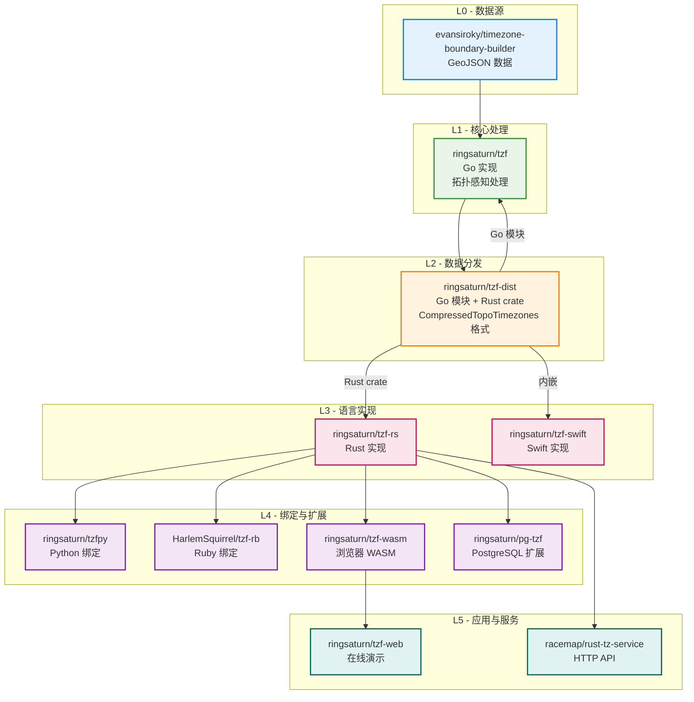

- **L0 - 数据源**：来自上游提供者的原始地理时区边界数据
  - [evansiroky/timezone-boundary-builder](https://github.com/evansiroky/timezone-boundary-builder)
- **L1 - 核心处理**：主要数据处理——拓扑感知多边形简化、
  共享边去重、Polyline 编码和瓦片预索引生成
  - [ringsaturn/tzf](https://github.com/ringsaturn/tzf)
- **L2 - 数据分发**：处理后的二进制数据，采用 `CompressedTopoTimezones` 格式，
  以 Go 模块和 Rust crate 形式分发
  - [ringsaturn/tzf-dist](https://github.com/ringsaturn/tzf-dist)
  - 文件：`combined-with-oceans.compress.topo.bin`（约 17 MB，完整精度）、
    `combined-with-oceans.topology.compress.topo.bin`（约 5.4 MB，精简版）、
    `combined-with-oceans.topology.preindex.bin`（约 2 MB，瓦片预索引）
- **L3 - 语言实现**：消费 tzf-dist 数据的核心时区查询实现
  - [ringsaturn/tzf-rs](https://github.com/ringsaturn/tzf-rs)
  - [ringsaturn/tzf-swift](https://github.com/ringsaturn/tzf-swift)
- **L4 - 语言绑定与扩展**：基于核心实现构建的封装库和数据库扩展
  - [ringsaturn/tzfpy](https://github.com/ringsaturn/tzfpy)
  - [HarlemSquirrel/tzf-rb](https://github.com/HarlemSquirrel/tzf-rb)
  - [ringsaturn/tzf-wasm](https://github.com/ringsaturn/tzf-wasm)
  - [ringsaturn/pg-tzf](https://github.com/ringsaturn/pg-tzf)
- **L5 - 应用与服务**：终端用户应用、Web 服务和 API 服务器
  - [ringsaturn/tzf-web](https://github.com/ringsaturn/tzf-web)
  - [racemap/rust-tz-service](https://github.com/racemap/rust-tz-service)
